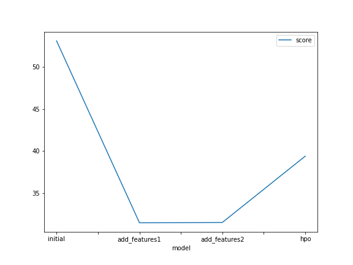
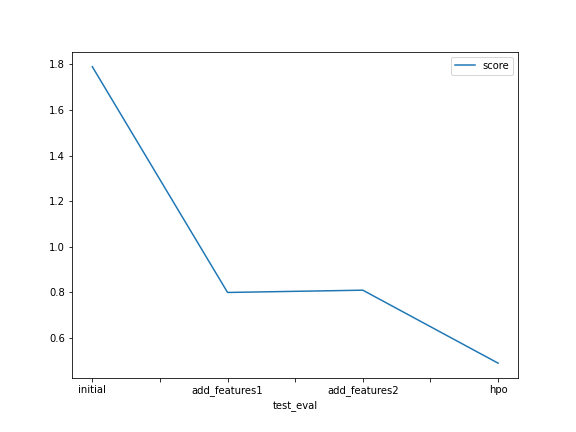

# Report: Predict Bike Sharing Demand with AutoGluon Solution
#### Annelise Gerber

## Initial Training
### What did you realize when you tried to submit your predictions? What changes were needed to the output of the predictor to submit your results?
Initial model performance was not great since no data pre-processing and feature engineering had
taken place. It was also required to replace predicted negative numbers with 0.

### What was the top ranked model that performed?
Top ranked raw model was: WeightedEnsemble_L3, RMSE on training data: 53.10, score on test data: 

## Exploratory data analysis and feature creation
### What did the exploratory analysis find and how did you add additional features?
Additional features added were year, month, day, weekday and hour. Additional features, binning windspeed, temp and
humidity, were also created to be used instead of the numerical variables. Correlation analysis on training data 
showed that corr(temp, atemp) = 0.98, so that 'atemp' together with 'datetime' variables were 
removed in the next model fit iterations. Also corr...
These features should help the model differentiate better between different weather patterns and time of day.

### How much better did your model preform after adding additional features and why do you think that is?
Two iterations adding features were carried out:
- Iteration 'add_new_features1'  added 'year', 'month', 'day', 'weekday', 'hour' and removed
'atemp', 'holiday' from training data (as well as 'casual','registered'). RMSE on train data was:

- Iteration 'add_new_features2'  also added 'year', 'month', 'day', 'weekday', 'hour' and removed
'atemp', 'holiday' but then used 'windspeed_level', 'humidity_level', 'temp_level' and removed the 
raw variables 'temp', 'windspeed', 'humidity' from training data (as well as 'casual','registered').
RMSE on train data was:

## Hyper parameter tuning
### How much better did your model preform after trying different hyper parameters?
Running NN, GBM and XGB models in combination with some hyper-parameter tuning, and using the features
listed under 'add_new_features2' further improved the model a little. The best model was, with an RMSE on train data:
TBC

### If you were given more time with this dataset, where do you think you would spend more time?
I would spend more time on EDA and data pre-processing, and initially checking how potential data leakage within the 
train data can be mitigated. The current setup as used under the assumption that train data is used to fit a model 
to predict missing test values with both train and test data being in the past - 
to fill gaps in past time series of bike share demand count.

EDA, further data pre-processing and feature engineering steps to include are:
- Outlier treatment: check and remove potential outliers in the data (a basic option is IQR)
- Check whether for the categorical variables there are strong relationships between some of them: 
use Chi-squared, Cramer's V to establish whether variables are related and remove them if required.
- Linear regression models make some assumptions on the distribution of the target variable, such as 
the target being normally distributed - plots indicate that this is not the case for the target variable: 
applying e.g. a log-transform to the target variable prior to prediction is expected to improve results.
- Also worth addressing: the target variable 'count' is an integer. This has not been addressed as part of prediction process.

### Create a table with the models you ran, the hyperparameters modified, and the kaggle score.
|model|hpo1|hpo2|hpo3|score|
|--|--|--|--|--|
|initial|?|?|?|?|
|add_features|?|?|?|?|
|hpo|?|?|?|?|

### Create a line plot showing the top model score for the three (or more) training runs during the project.

TODO: Replace the image below with your own.

### Create a line plot showing the top kaggle score for the three (or more) prediction submissions during the project.

TODO: Replace the image below with your own.

## Summary
In this project I was able to use knowledge gained in Course1 as well as Amazon SageMaker Studio in
combination with autogluon to fit a basic regression model. The project highlighted that EDA and 
data pre-processing as well as tuning hyper-parameters can further improve a model. 
